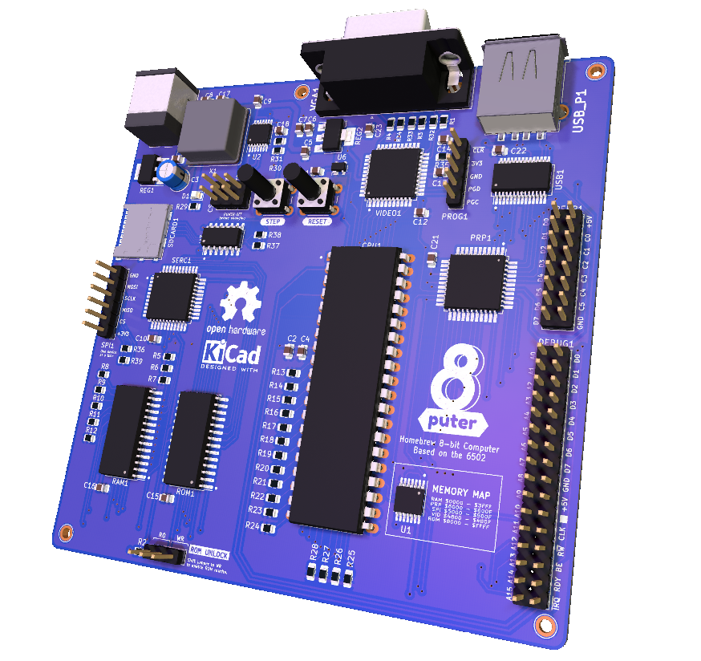

# 8puter

This is a Homebrew 8-bit computer project, using mostly simple modern parts.
Based on the legendary MOS6502 processor, we are using the modern CMOS version made by WDC. Basically an exercise in computer architechture. I plan to get this manufactured into a PCB and assemble myself into a working computer. 

Please feel free to leave reviews/sanity checks from people who have done this sort of thing before, or know something about this, in the [issues](/issues).  

## Preview

Here is a picture of a 3D model of the completed PCB.

  

// 
<a href="plots/8puter.pdf">Schematic</a> / 
<a href="plots/8puter.csv">Bill of Materials</a> 
//

## My Goals

The main thing I want to be able to do with this SBC is to program it with itself. This means having some way to input text from a keyboard and display it to some kind of screen/output device, and I've chosen a VGA monitor for this. I'm not trying to keep this compatible with the ROMs/BIOSs or code of old but I want to be able to write my own, preferably on the machine itself. 
Also, I dont want to use discrete logic for everything since I have some experience with trying to make that work. I'm also not necessarily using all DIP chips because of lack space, and going SMD isnt that much of a problem.

To store programs on a sort of "disk", I thought I need to add some sort of serial interface which can talk to a microSD card, such that the computer can use it as storage. This is accomplished via SPI. 
The peripheral interface talks to a USB controller and *should* be able to use a USB keyboard as input device. This idea was taken from the schematic of the [SBC dev board that WDC sells](https://wdc65xx.com/Single-Board-Computers/w65c02sxb/).

The video signal is being generated by a microcontroller because I thought that's probably the easiest way to get it working without worrying about a lot of VGA signal timing. This MCU is fast enough to generate a 640x480 screen and has enough memory to store the framebuffer and its the only *cheat* I've used. Some more details are in my schematic

### Main Parts

**uProcessor:** W65C02S  
**ROM and RAM:** AT28C256 and AS6C62256, both 32K  
**VIA:** W65C22  
**USB I/f:** FT245RL  
**Video:** PIC32MX270 uController

## Manufacturing

So after quite a while, I have finally got this PCB manufactured and it came out better than I had imagined.
I was having trouble finding a local PCB maker who had the right capabilities and would manufacture this board at a small scale. 
Then I found Robu.in and their manufacturing service. I'm not sure if they've been doing this for a while but I never knew about them.

The board files are ready to send to a manufacturer of your choice as they are. You can find the gerbers in a ZIP and just fire them off. 
I recommend Robu.in if you're in India. Otherwise I'd recommend PCBWay.com

See the [Releases](https://github.com/zrthxn/8puter/releases) for updates.

## Resources

Some great resources I found for this project, including those from people who have done this sort of thing before.

- [Ben Eater's Excellent Videos](https://www.youtube.com/watch?v=LnzuMJLZRdU&list=PLowKtXNTBypFbtuVMUVXNR0z1mu7dp7eH)
- [George Foot's videos](https://www.youtube.com/watch?v=EC1Ous1zT5w&list=PLWKtKD_FaUF6IsFc1maERpOwWM2hrOM3b)
- [forum.6502.org](http://forum.6502.org/)
- [WDC's own SBC board schematic](https://wdc65xx.com/Single-Board-Computers/w65c02sxb/)
- [6052 Primer](http://wilsonminesco.com/6502primer) on how to get started building your own, especially the [address decode](http://wilsonminesco.com/6502primer/addr_decoding.html) section
- [6502.org: Homebuilt Projects](http://www.6502.org/homebuilt)
- [This guy's breadboard computer](https://www.youtube.com/watch?v=sdFXc0Rkpvc&list=PLdGm_pyUmoII9D16mzw-XsJjHKi3f1kqT) which is based on the (later) 65816 processor, but has some great ideas.
